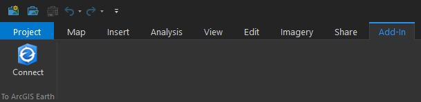

# ArcGIS Pro To ArcGIS Earth
synchronize camera view of ArcGIS Pro with ArcGIS Earth.

### Build
Build and compile the add-in using source codes provided. Modify codes where necessary in your own program.

### Use
1. Double click to install the add-in. 
2. Start ArcGIS Pro.
3. Once successfully installed, you can find the add-in appears on the Add-In tab of ArcGIS Pro.

4. Start ArcGIS Earth and make sure the Auatomation API status is available. 
5. Click the Connect button from ArcGIS Pro Add-In tab.
6. Enjoy the tool!
